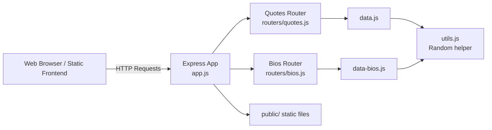

# Quotes and Biographies API

<p align="center">
  
  
  
  
  
  
</p>

A lightweight REST API and browser-based UI for managing a curated collection of quotes and biographies. The project demonstrates a full CRUD workflow using Express, in-memory data storage, and a static front end for adding, updating, deleting, and viewing records.

## Features

- REST API for quotes with CRUD operations
- REST API for bios with CRUD operations
- Random resource selection via dedicated endpoints
- Filtering by author/person name
- CORS-enabled requests for browser-based clients
- Static HTML, CSS, and JavaScript front end for quick local testing
- In-memory JSON data model for simplicity and fast setup

## Tech Stack

### Core technologies

- Node.js
- Express.js
- JavaScript
- HTML5
- CSS3
- CORS middleware

### Application patterns

- RESTful routing
- Route-level validation and sanitization
- Express router modules for separation of concerns
- Static file hosting for the public UI
- In-memory persistence for demo and learning purposes

## Project Structure

```text
Quote-API/
├── app.js                 # Express app setup and route mounting
├── main.js                # Server startup and port configuration
├── data.js                # Quote dataset
├── data-bios.js           # Biography dataset
├── utils.js               # Shared helper functions
├── package.json           # Project metadata and scripts
├── public/                # Static frontend pages and assets
│   ├── index.html
│   ├── quotes.html
│   ├── bios.html
│   ├── add-quote.html
│   ├── add-bio.html
│   ├── update-quote.html
│   ├── update-bio.html
│   ├── delete-quote.html
│   ├── delete-bio.html
│   ├── script.js
│   └── styles.css
├── routers/
│   ├── quotes.js
│   └── bios.js
└── README.md
```

## Getting Started

### Prerequisites

- Node.js 18+ recommended
- npm

### Installation

```bash
npm install
```

### Run the app

```bash
npm start
```

The server starts on port `4001` by default unless `PORT` is provided in the environment.

## API Usage

Base URL:

```text
http://localhost:4001
```

### Quotes

#### Get all quotes

```bash
curl http://localhost:4001/api/quotes
```

#### Get a random quote

```bash
curl http://localhost:4001/api/quotes/random
```

#### Filter quotes by person

```bash
curl "http://localhost:4001/api/quotes?person=grace%20hopper"
```

#### Create a quote

```bash
curl -X POST http://localhost:4001/api/quotes \
  -H "Content-Type: application/json" \
  -d '{
    "quote": "Simplicity is the soul of efficiency.",
    "person": "Austin Freeman",
    "year": 2024
  }'
```

#### Update a quote

```bash
curl -X PUT http://localhost:4001/api/quotes/1 \
  -H "Content-Type: application/json" \
  -d '{
    "quote": "Updated quote text.",
    "person": "Ada Lovelace",
    "year": 1843
  }'
```

#### Delete a quote

```bash
curl -X DELETE http://localhost:4001/api/quotes/1
```

### Bios

#### Get all bios

```bash
curl http://localhost:4001/api/bios
```

#### Get a bio by id

```bash
curl http://localhost:4001/api/bios/1
```

#### Get a random bio

```bash
curl http://localhost:4001/api/bios/random
```

#### Create a bio

```bash
curl -X POST http://localhost:4001/api/bios \
  -H "Content-Type: application/json" \
  -d '{
    "person": "Alan Turing",
    "birthYear": 1912,
    "bio": "Alan Turing was a British mathematician and computer scientist."
  }'
```

#### Update a bio

```bash
curl -X PUT http://localhost:4001/api/bios/1 \
  -H "Content-Type: application/json" \
  -d '{
    "person": "Ada Lovelace",
    "birthYear": 1815,
    "bio": "Updated biography text for Ada Lovelace."
  }'
```

#### Delete a bio

```bash
curl -X DELETE http://localhost:4001/api/bios/1
```

## Response Format

Responses are returned as JSON objects.

Example quote response:

```json
{
  "quote": {
    "id": 1,
    "quote": "We build our computer (systems) the way we build our cities: over time, without a plan, on top of ruins.",
    "person": "Ellen Ullman",
    "year": 1997
  }
}
```

Example list response:

```json
{
  "quotes": [
    {
      "id": 1,
      "quote": "...",
      "person": "...",
      "year": 2024
    }
  ]
}
```

## Validation and Safety

The API validates incoming data before accepting it. Examples include:

- required text fields for quote and person data
- length limits for quote and bio content
- valid integer year/birthYear values
- sanitization against HTML and control characters
- 400 responses for malformed requests
- 404 responses for missing resources

## High-Level Architecture



### Architecture summary

The application follows a simple layered architecture:

1. The Express application in `app.js` bootstraps the server and mounts routes.
2. The route modules handle HTTP endpoints and request validation.
3. The data modules hold the in-memory datasets used by the app.
4. The static `public` folder serves HTML pages and JavaScript for browser interactions.
5. Requests are processed in memory without a database, making the project ideal for learning, prototyping, and API testing.

## Typical Use Cases

- building a small content API for quotes and biographies
- demonstrating CRUD interactions in a Node.js course
- testing client-side fetch calls against a real server
- learning Express routing and validation patterns
- exploring front-end and back-end integration

## Notes

This project intentionally uses in-memory arrays rather than a database. That makes it easy to understand and modify, but data resets whenever the server restarts.

## License

This project is provided for educational use and follows the project’s included license terms.
